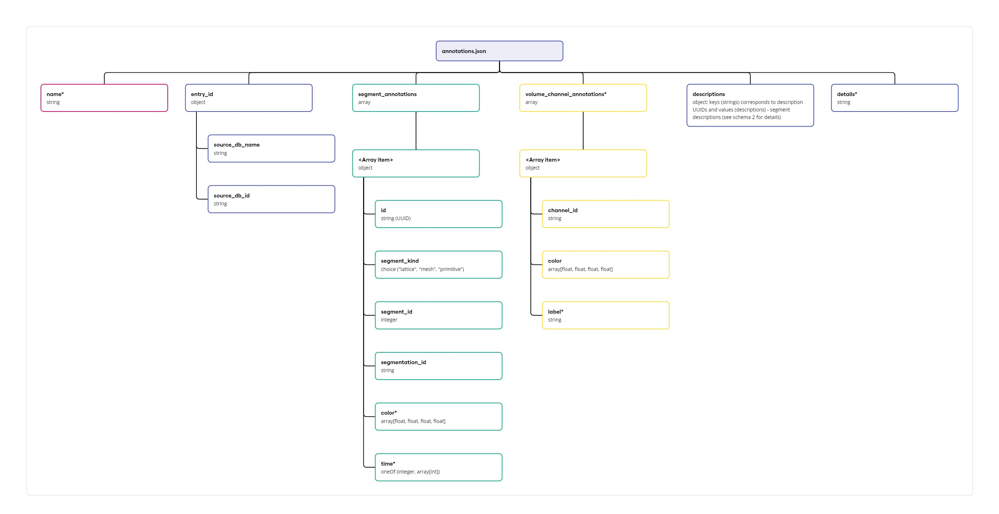

# edit-segment-annotations
This command allows editing segment 
annotations in `annotations.json` which is a part of an internal database entry. Requires the following arguments:

| Argument | Description |
| -------- | ---------- |
| `--entry_id` (string) | entry ID in internal database, corresponding to the entry folder name (e.g. `emd-1832`) |
| `--source_db` (string) | source database, corresponding to the source database folder name in internal database (e.g. `emdb`)|
| `--db_path` (string) | specifies the path to the internal database |
| `--data_json_path` (string) | specifies path to JSON file with segment annotations. This file represents a list of objects, each of which follow a specific data model (see diagram below, `annotations` field). An example of such file is provided under the schema. |

[](annotations_metadata_schema.jpg)
```json
[
    {
        "color": [
            0.1,
            0.1,
            0.1,
            1.0
        ],
        "id": "bd89b35f-25c3-4cef-bcb3-1df624b13f4d",
        "segment_id": 85,
        "segment_kind": "lattice",
        "segmentation_id": "0",
        "time": 0
    },
    {
        "color": [
            0.9,
            0.9,
            0.9,
            1.0
        ],
        "id": "b79dfd1e-a00c-4cd7-8d49-305c73c1fd81",
        "segment_id": 93,
        "segment_kind": "lattice",
        "segmentation_id": "0",
        "time": 0
    }
]
```

