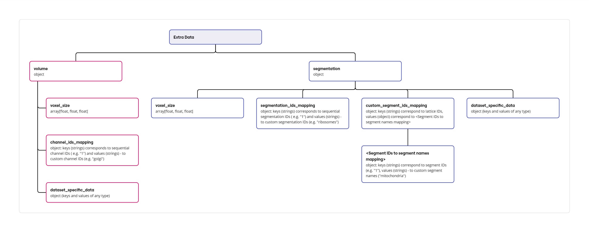

# Advanced Parameters

The Preprocessor offers a selection of additional command-line arguments that empower users to exert finer-grained control over the preprocessing workflow. These arguments are not mandatory but can be employed to tailor the preprocessing to specific requirements.


## --quantize-dtype-str

This argument enables the quantization of volumetric data. Quantization reduces the data's precision, resulting in a smaller file size but lowers the precision of the data. When employing this argument, users can specify the desired data type for the quantized data using either the `u1` option (resulting in an 8-bit unsigned byte data type) or the `u2` option (resulting in a 16-bit unsigned integer data type).


## --quantize-downsampling-levels

The `--quantize-downsampling-levels` argument facilitates the selective quantization of downsampled data within the preprocessing workflow. This argument allows users to specify a sequence of numerical identifiers, where each identifier corresponds to a specific downsampling level. For instance, the argument `1 2` would trigger the quantization of downsampling level `1` (typically original resolution volume data), and downsampling level `2` (typically representing data downsampled twice in each direction).

The data type employed for the quantized data will adhere to the specifications provided using the `--quantize-dtype-str` argument (described previously).


## --force-volume-dtype

The `--force-volume-dtype` argument provides users with the capability to override the automatically inferred data type for volume data derived from electron density maps. This option proves particularly valuable in scenarios where the electron density map may contain erroneous header information. A common example of such erroneous data is an incorrect value of `MODE` variable within the main header of MRC/CCP4 files.


## --max-size-per-downsampling-lvl-mb

The `--max-size-per-downsampling-lvl-mb` argument, along with the following three arguments to be discussed, empowers users to exert a more granular level of control over the downsampling process within the Preprocessor. This argument facilitates the specification of a desired maximum data size per downsampling level, expressed in megabytes (MB).


## --min-size-per-downsampling-lvl-mb

The `--min-size-per-downsampling-lvl-mb` argument complements the previously discussed `--max-size-per-downsampling-lvl-mb` argument, enabling users to define a minimum desired data size per downsampling level, also expressed in megabytes (MB). This argument possesses a default value of `5.0` MB. The Preprocessor employs both the minimum and maximum size constraints to determine the optimal downsampling strategy.


## --min-downsampling-level

This argument allows users to specify the minimum level of downsampling to be applied to the input data. The argument takes an integer value representing the desired minimum downsampling level.


## --max-downsampling-level

This argument allows users to specify the maximum level of downsampling to be applied to the input data. Similar to the `--min-downsampling-level` argument, it takes an integer value representing the desired maximum downsampling level.


## --remove-original-resolution

The `--remove-original-resolution` argument functions as an optional flag that can be employed by users to instruct the Preprocessor to exclude the original resolution data from the final entry data. This can be a valuable option in scenarios where storage space is a significant constraint, as the original resolution data typically have the largest size within an entry.


# Extra data as additional input file for Preprocessor

In addition to the standard command-line arguments discussed previously, the Preprocessor offers a set of advanced functionalities currently classified as experimental. These functionalities are designed to:


* **Supplement database entries**: Users can leverage this functionality to incorporate supplementary data into the corresponding database entry during the preprocessing stage. This can be particularly beneficial in situations where the raw input data lacks crucial information or contains erroneous details.
* **Overwrite database entry parameters**: The Preprocessor also empowers users to modify specific parameters associated with the database entry during preprocessing. This functionality can be valuable for correcting inconsistencies or inaccuracies within the raw input data.

It is important to note that this functionality is under active development, and we welcome any suggestions or contributions from the user community to further enhance its capabilities.

To leverage this advanced functionality, users should provide an additional input file in JSON format alongside the standard input files containing volume and/or segmentation data. The structure of this JSON file needs to adhere to a specific data model:

[](extra_data_schema.jpg)

Note that all fields within the extra data section are designated as optional. Besides, the file containing the extra data must be provided as the first input file during the preprocessing execution. Full JSON schema is available online at [Github repository](https://github.com/molstar/molstar-volseg/blob/master/db/cellstar_db/extra_data_schema.json). 

[Tutorial on adding empiar-11756 entry to the internal database](../preprocessor/preprocess.md#empiar-11756) provides a practical example of utilizing JSON with extra data as one of the Preprocessor's input arguments. In this specific instance, this advanced functionality is employed to override the voxel size that the Preprocessor would automatically determine based on erroneous map header data within the volume map input file.

The following excerpt showcases a sample structure for a JSON file containing extra data, specifically designed for the aforementioned use case of overriding voxel size information:

This section presents another illustrative example pertaining to the preprocessing workflow for the `EMPIAR-10988` entry. A detailed tutorial outlining this process can be found at [Github repository](../preprocessor/preprocess.md#empiar-10988).

In this particular case, the purpose of using extra data is to modify the segment identifications automatically assigned by the Preprocessor during the analysis of electron density mask files. Grid data in these files typically consists of integer values, e.g. `1` or `2`. As the Preprocessor automatically uses these values as segment IDs, this translates to generic segment names, such as `Segment 1`, `Segment 2` etc. While it is possible to manually edit this via `Annotation Editor`, we offer an advanced option that allows the user to achieve the same result with the help of extra data functionality. It allows users to easily replace these with more biologically relevant segment IDs, such as `cytoplasm` or `mitochondria` via providing a JSON file following specific format as the first input file to the Preprocessor.

The following code snippet illustrates a possible configuration for the extra data JSON file, specifically designed to achieve the aforementioned customization of segment IDs for the EMPIAR-10988 entry:


```json
{
    "segmentation": {
        "custom_segment_ids_mapping": {
            "TS_026.labels": {
                "1": "cytoplasm",
                "2": "mitochondria",
                "3": "vesicle",
                "4": "tube",
                "5": "ER",
                "6": "nuclear envelope",
                "7": "nucleus",
                "8": "vacuole",
                "9": "lipid droplet",
                "10": "golgi",
                "11": "vesicular body",
                "13": "not identified compartment"
            }
        }
    }
}
```