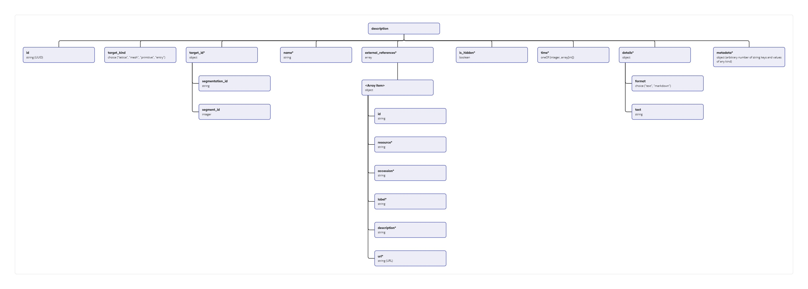

# edit-descriptions
This command allows editing (adding or modifying) descriptions in `annotations.json` which is a part of internal database entry. Requires the following arguments:

| Argument | Description |
| -------- | ---------- |
| `--entry_id` (string) | entry ID in internal database, corresponding to the entry folder name (e.g. `emd-1832`) |
| `--source_db` (string) | source database, corresponding to the source database folder name in internal database (e.g. `emdb`)|
| `--db_path` (string) | specifies the path to the internal database |
| `--data_json_path` (string) | specifies path to JSON file with descriptions. This file represents a list of objects, each of which follow a specific data model (see diagram below). An example of such file is provided under the schema. |

[](description_schema.jpg)

```shell
[
    {
        "description": null,
        "id": "656c7c04-3650-4d10-a714-1173b43bf256",
        "is_hidden": null,
        "metadata": null,
        "name": "DNA replication licensing factor MCM4",
        "target_id": {
            "segment_id": 97,
            "segmentation_id": "0"
        },
        "target_kind": "lattice",
        "time": 0
    },
    {
        "description": null,
        "external_references": [
            {
                "accession": "GO_0006260",
                "description": "The cellular metabolic process in which a cell duplicates one or more molecules of DNA. DNA replication begins when specific sequences, known as origins of replication, are recognized and bound by initiation proteins, and ends when the original DNA molecule has been completely duplicated and the copies topologically separated. The unit of replication usually corresponds to the genome of the cell, an organelle, or a virus. The template for replication can either be an existing DNA molecule or RNA.",
                "id": 41,
                "label": "DNA replication",
                "resource": "go",
                "url": "http://purl.obolibrary.org/obo/GO_0006260"
            }
        ],
        "id": "8a1739df-6d3a-49f6-b2e6-7927d953f8af",
        "is_hidden": null,
        "metadata": null,
        "name": "DNA replication licensing factor MCM2",
        "target_id": {
            "segment_id": 85,
            "segmentation_id": "0"
        },
        "target_kind": "lattice",
        "time": 0
    }
]
```
