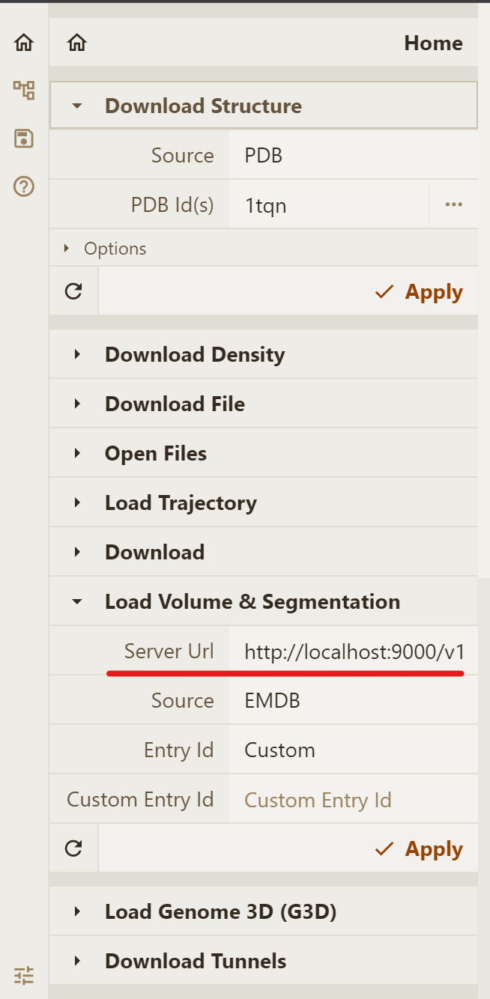

# Background
In order to visualize an internal database entry using local instance of Mol\* 3D viewer, you need to host a local instance of server API. Local instance of Mol\* 3D viewer then will be able to send dynamic queries to the local instance of server API, and visualize their results.

# Hosting Server API
Make changes in `server/cellstar_server/app/settings.py` file. `DB_PATH` constant (line `8` in the code block below) should point to the path to your internal database that was built using Preprocessor, e.g.:

```python
from pathlib import Path
from pydantic import BaseSettings

class _Settings(BaseSettings):
    HOST: str = "0.0.0.0"
    PORT: int = 9000
    DEV_MODE: bool = False
    DB_PATH: Path = Path('preprocessor/temp/test_db')
    GIT_TAG: str = ''
    GIT_SHA: str = ''

settings = _Settings()
```

Optionally, you can change the HOST and PORT constants to deploy server API at a local address other than `localhost` `127.0.0.1` (`0.0.0.0`) and port other than `9000`.

From the root repository directory, run `server/cellstar_server/serve.py` script to deploy the server API:

```shell
python server/cellstar_server/serve.py
```
 
It will deploy server API at [http://localhost:9000/](http://localhost:9000/) with API documentation available at [http://localhost:9000/docs](http://localhost:9000/docs).

In order for Mol\* Volumes & Segmentations extension of Mol\* 3D viewer to be able to load entries, [http://localhost:9000/v1](http://localhost:9000/v1) should be specified as Server Url parameter:

